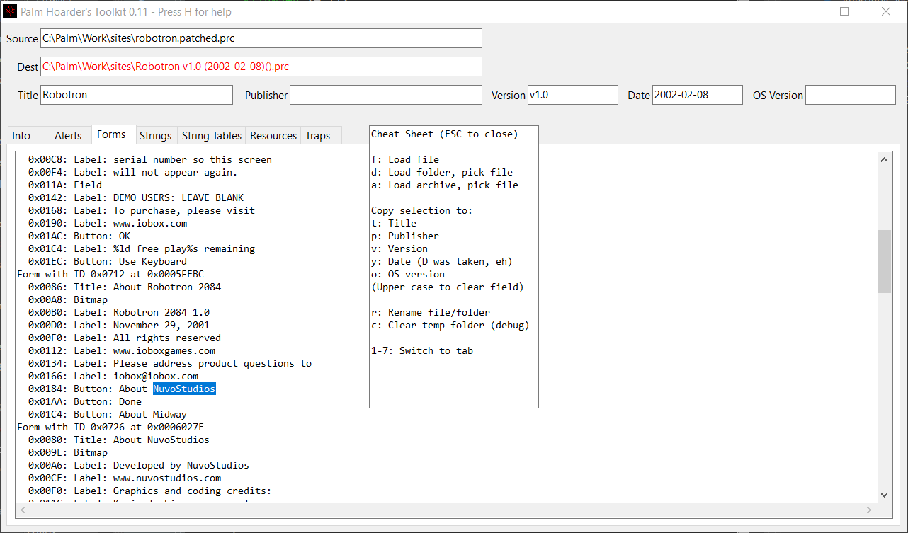

# Palm Hoarder's Toolkit (WIP)
A glorified GUI version of pHist (really).

## DISCLAIMER
No warranties! Use at your own risk! If anything breaks, it's NOT my fault.

## Before you get any fancy ideas
This is certainly not available to anyone yet. As long as there is even a minimal chance of deleting the wrong files, it stays within my four walls. Don't even ask.

## tl;dr

## The slightly longer version
Some time ago, i got the fabulous idea of archiving Palm software, TOSEC style.

After three years of crawlingly slow progress, i sat down and did the maths. In two hours, i could do a hundred files, if i was really warmed up and ready to go.

As of right now, i have 672'000 files and around a hundred ISO images left to sort. That is quite a bit longer than i plan on living.

So i got an idea about how to both speed up the process a bit, as well as making it easy for others to join the madness. And this is pretty much it.

## How to use
- Load up a file, folder or archive. Values from the .prc header will be filled in for you.
- Browse around the resources to fill in the blanks. When you find the missing text, just highlight it and press the button for the field you want to fill. For instance, in the screenshot above, pressing "p" would copy "NuvoStudios" into the "Publisher" field. You can also spot that the computed date is wrong, which can be fixed manually.
- The Dest field will be in red text, until enough information is present to satisfy the minimal TOSEC naming specs. When black, you can hit "r" and rename your source file.

## Requirements

None, unless you want to work with archives. In that case, 7z / 7z.exe must be in your PATH (the Windows version will also look for C:\Program Files\7-Zip\7z.exe).

On Linux you can get rar support by adding the 7zip-rar package (Debian and derivatives) - the Windows version should have this by default.

p7zip from Homebrew might or might not work on macOS - i will test in the future.

## What was used:
- The latest sources for pHist (which i think never really got a version number).
- imhex for pinpointing a couple of bugs in pHist.
- Lazarus for everything GUI related, especially the incredibly ugly looks.
- Cosmic amounts of coffee.

## Inspired and helped by:
- Nothing and noone - yet ..

## License
When the time comes, it will be copyrighted, no derivatives allowed, source available. But that's of no concern at the time of writing - still a long way to go.

